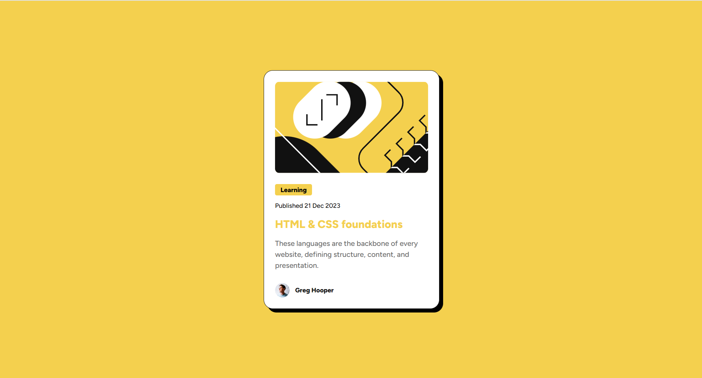

# Frontend Mentor - Blog preview card solution

This is a solution to the [Blog preview card challenge on Frontend Mentor](https://www.frontendmentor.io/challenges/blog-preview-card-ckPaj01IcS). Frontend Mentor challenges help you improve your coding skills by building realistic projects.

## Table of contents

- [Overview](#overview)
  - [The challenge](#the-challenge)
  - [Screenshot](#screenshot)
  - [Links](#links)
- [My process](#my-process)
  - [Built with](#built-with)
  - [What I learned](#what-i-learned)
  - [Continued development](#continued-development)
  - [Useful resources](#useful-resources)
- [Author](#author)
- [Acknowledgments](#acknowledgments)

## Overview

### The challenge

Users should be able to:

- See hover and focus states for all interactive elements on the page

### Screenshot



### Links

- Solution URL: [Github Repo Link](https://github.com/akshitjain3/fem-BlogPreviewCard)
- Live Site URL: [Github Pages Link](https://akshitjain3.github.io/fem-BlogPreviewCard/)

## My process

### Built with

- Semantic HTML5 markup
- CSS custom properties
- Flexbox
- Mobile-first workflow

### What I learned

Glad to make this webpage a little responsive using media queries, implement Flexbox in a beautiful and elegant way and also use some pseudo classes in css.

```css
@media (min-width: 640px) {
  .text-preset1 {
    font-size: 24px;
  }

  .text-preset2 {
    font-size: 16px;
  }

  .text-preset3 {
    font-size: 14px;
  }

  .text-preset4 {
    font-size: 14px;
  }

  .blogCard {
    width: 384px;
    height: 522px;
  }

  .blog-image,
  .blog-content {
    width: 100%;
  }
}

.blog-title:hover {
  color: var(--yellow);
}
```

### Continued development

Would like to build more complex static web pages using Frontend Mentor, this is just the start, will code more responsive and robust web pages.

## Author

- Frontend Mentor - [@akshitjain3](https://www.frontendmentor.io/profile/akshitjain3)
